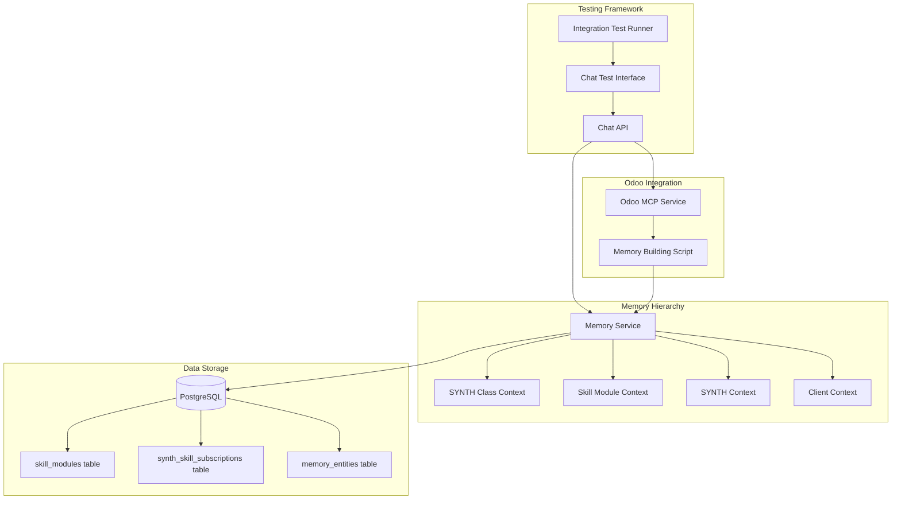

# Design Document

## Overview

The Chat API Testing with Odoo Integration feature establishes a comprehensive testing framework that validates multi-contextual memory integration with Odoo ERP through MCP (Model Context Protocol). The system introduces a new hierarchical memory dimension (skill_modules) and validates chat functionality across both active tutor and passive agent modes. This design ensures proper integration between the SparkJAR chat API, the hierarchical memory system, and Odoo MCP services.

## Architecture

### High-Level Architecture



### Memory Hierarchy Design

```
Priority Order (highest to lowest):
1. Client Context (overrides all)
2. SYNTH Context (individual agent)
3. Skill Module Context (Odoo-specific knowledge)
4. SYNTH Class Context (base patterns and guardrails)
```

## Components and Interfaces

### 1. Skill Module Integration

**Database Schema**:

```sql
-- skill_modules table (already created)
CREATE TABLE skill_modules (
    id UUID PRIMARY KEY,
    name VARCHAR(255) UNIQUE NOT NULL,
    module_type VARCHAR(100) NOT NULL, -- 'erp_sales', 'erp_finance', etc.
    vendor VARCHAR(100), -- 'Odoo'
    version VARCHAR(50), -- '16.0', '17.0'
    metadata JSONB NOT NULL DEFAULT '{}',
    active BOOLEAN DEFAULT true,
    created_at TIMESTAMP WITH TIME ZONE DEFAULT NOW(),
    updated_at TIMESTAMP WITH TIME ZONE DEFAULT NOW()
);

-- synth_skill_subscriptions junction table
CREATE TABLE synth_skill_subscriptions (
    synth_id UUID NOT NULL REFERENCES synths(id),
    skill_module_id UUID NOT NULL REFERENCES skill_modules(id),
    subscribed_at TIMESTAMP WITH TIME ZONE DEFAULT NOW(),
    active BOOLEAN DEFAULT true,
    metadata JSONB DEFAULT '{}',
    PRIMARY KEY (synth_id, skill_module_id)
);
```

**Memory Service Extension**:
- Treat skill_modules as new actor_type = 'skill_module'
- Support skill_module_id as actor_id in memory queries
- Extend hierarchical query logic to include skill modules

### 2. Odoo Memory Building Script

**Location**: `odoo-mcp-repo/scripts/build_odoo_memory.py`

**Core Functions**:

```python
class OdooMemoryBuilder:
    def __init__(self, memory_client, odoo_version):
        self.memory_client = memory_client
        self.odoo_version = odoo_version
        
    async def build_skill_module_memory(self, skill_module_id):
        """Build Odoo-specific memory for a skill module"""
        # Extract Odoo module documentation
        # Create procedural knowledge entities
        # Store field mappings and workflows
        
    async def build_synth_class_memory(self, synth_class_id):
        """Build base patterns and guardrails"""
        # Store general ERP best practices
        # Add security and compliance rules
        # Include interaction patterns
        
    async def build_multi_contextual_memory(self):
        """Orchestrate memory building across contexts"""
        # Build skill_module memories
        # Build synth_class memories
        # Validate cross-context consistency
```

**Key Features**:
- Dynamic memory building based on installed Odoo version
- Periodic execution via cron or event triggers
- Multi-dimensional contextualization support
- Error recovery and detailed logging

### 3. Chat API Test Interface

**Location**: `services/crew-api/src/chat/testing/`

**Components**:

#### TestChatController
```python
class TestChatController:
    def __init__(self, chat_controller, memory_service):
        self.chat_controller = chat_controller
        self.memory_service = memory_service
        
    async def test_with_synth_config(self, synth_config):
        """Test chat with specific synth configuration"""
        # Configure synth with skill modules
        # Test both tutor and agent modes
        # Validate memory retrieval
```

#### MemoryValidationService
```python
class MemoryValidationService:
    async def validate_hierarchical_retrieval(self, query_params):
        """Validate memory retrieval follows hierarchy"""
        # Test each context level
        # Verify precedence rules
        # Check context merging
        
    async def validate_skill_module_access(self, synth_id):
        """Ensure synth can access subscribed skill modules"""
        # Query synth_skill_subscriptions
        # Verify memory accessibility
        # Test knowledge application
```

### 4. Interactive Testing Framework

**Chat Modes**:

1. **Active Tutor Mode**:
   - Synth proactively guides users
   - Uses skill_module knowledge to suggest next steps
   - Provides contextual explanations
   - Example: "I see you're creating a sales order. Let me guide you through the Odoo workflow..."

2. **Passive Agent Mode**:
   - Synth waits for instructions
   - Executes tasks using memory context
   - Provides status reports
   - Example: "Task completed. I've created the sales order with the specifications you provided."

**Test Scenarios**:

```python
class ChatTestScenarios:
    async def test_odoo_sales_workflow(self):
        """Test complete sales workflow interaction"""
        # Configure synth with Odoo Sales skill module
        # Test tutor mode guidance
        # Switch to agent mode for execution
        # Validate memory usage throughout
        
    async def test_context_precedence(self):
        """Test memory hierarchy precedence"""
        # Create conflicting contexts
        # Verify client overrides skill_module
        # Test skill_module and synth_class coexistence
```

## Implementation Strategy

### Phase 1: Database and Memory Service Updates
1. Execute skill_modules migration
2. Update database models
3. Extend Memory Service for skill_module actor_type
4. Test hierarchical queries with new dimension

### Phase 2: Odoo MCP Integration
1. Develop memory building script in Odoo MCP repo
2. Create skill module knowledge extractors
3. Implement periodic memory update mechanism
4. Test memory building with sample Odoo data

### Phase 3: Chat API Testing Framework
1. Create test chat controller
2. Implement memory validation service
3. Develop interactive test scenarios
4. Build test synth configurations

### Phase 4: Integration Testing
1. End-to-end workflow tests
2. Performance validation
3. Memory consistency checks
4. Mode switching tests

## Data Flow

### Memory Building Flow
```
Odoo System ’ Odoo MCP ’ Memory Builder Script ’ Memory Service API ’ PostgreSQL
```

### Chat Testing Flow
```
Test Interface ’ Chat API ’ Memory Service ’ Hierarchical Query ’ Response Generation
```

### Context Resolution Flow
```
Query ’ Check Client Context ’ Check Synth Context ’ Check Skill Module ’ Check Synth Class ’ Merge Results
```

## Error Handling and Recovery

### Memory Building Errors
- Retry with exponential backoff
- Partial update rollback capability
- Detailed error logging with context
- Manual recovery procedures

### Chat Testing Errors
- Graceful fallback to API testing
- Context isolation for failed tests
- Comprehensive error reporting
- Test state cleanup

## Security Considerations

1. **Skill Module Access Control**:
   - Validate synth subscription before memory access
   - Audit trail for skill module assignments
   - Client-level access restrictions

2. **Memory Isolation**:
   - Ensure client data doesn't leak across contexts
   - Validate actor_type/actor_id combinations
   - Sanitize memory queries

3. **Test Data Security**:
   - Use dedicated test clients
   - Isolate test memory from production
   - Clean up test data after runs

## Performance Considerations

1. **Memory Query Optimization**:
   - Index on (actor_type, actor_id) combinations
   - Cache frequently accessed skill modules
   - Batch memory retrievals

2. **Chat Response Time**:
   - Target < 500ms for memory retrieval
   - Stream responses for better UX
   - Implement query result pagination

3. **Memory Building Efficiency**:
   - Incremental updates vs full rebuilds
   - Parallel processing for multiple contexts
   - Resource throttling during peak hours

## Testing Strategy

### Unit Tests
- Memory hierarchy logic
- Skill module access control
- Context merging algorithms
- Mode switching logic

### Integration Tests
- Odoo MCP connectivity
- Memory Service integration
- Chat API responses
- End-to-end workflows

### Performance Tests
- Concurrent chat sessions
- Large memory datasets
- Context switching overhead
- Response time benchmarks

## Success Metrics

1. **Functional Metrics**:
   - 100% of skill modules accessible to subscribed synths
   - Correct context precedence in 100% of queries
   - Smooth mode transitions without errors

2. **Performance Metrics**:
   - Memory retrieval < 500ms (p95)
   - Chat response generation < 1s (p95)
   - Support 100+ concurrent test sessions

3. **Quality Metrics**:
   - Zero memory leaks across contexts
   - 100% test coverage for critical paths
   - No regression in existing functionality

## Future Enhancements

1. **Dynamic Skill Module Discovery**:
   - Auto-detect new Odoo modules
   - Self-updating memory structures
   - Version-aware knowledge management

2. **Advanced Testing Capabilities**:
   - Automated test generation from Odoo workflows
   - Performance regression detection
   - A/B testing for response strategies

3. **Enhanced Memory Features**:
   - Temporal memory (version history)
   - Confidence scoring for knowledge
   - Cross-skill module relationship mapping