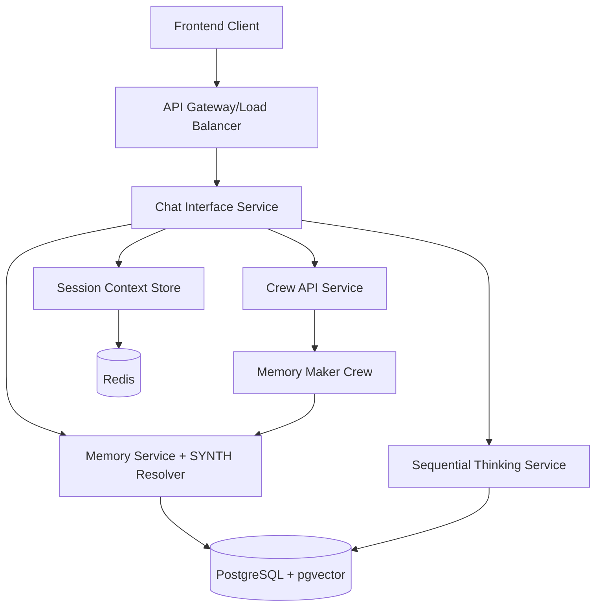

# Design Document

## Overview

The Chat Interface with Memory is a new service that provides SYNTH-like conversational capabilities with integrated memory access and optional sequential thinking. The service operates within the SparkJAR ecosystem, leveraging existing memory and thinking services while providing a scalable chat interface that can handle thousands of concurrent conversations across multiple clients.

## Architecture

### High-Level Architecture



### Service Integration Points

1. **Memory Service Integration**: REST API calls for entity retrieval, search, and UPSERT operations
2. **Sequential Thinking Service**: REST API calls for thinking session management
3. **Crew API Integration**: Asynchronous crew job submission for memory consolidation
4. **Session Management**: Redis-based session storage for conversation context
5. **SYNTH Hierarchy Resolution**: Database queries to resolve SYNTH class, company, and client contexts

## Components and Interfaces

### 1. Chat Interface Service

**Location**: `services/chat-interface/`

**Core Components**:

#### ChatController
- Handles incoming chat requests
- Manages conversation flow
- Coordinates with memory and thinking services
- Implements streaming response capability

#### ConversationManager
- Maintains conversation state during sessions
- Handles context window management
- Coordinates memory retrieval and integration
- Manages sequential thinking mode activation

#### MemoryIntegrationService
- Interfaces with Memory Service API
- Performs semantic search for relevant memories
- Handles memory layering across hierarchy levels
- Manages memory conflict resolution

#### StreamingResponseHandler
- Implements Server-Sent Events (SSE) for real-time streaming
- Handles connection management and error recovery
- Provides fallback to complete response delivery

### 2. Memory Maker Crew

**Location**: `services/crew-api/src/crews/memory_maker_crew/`

**Components**:

#### MemoryMakerCrewHandler
- Extends BaseCrewHandler
- Processes conversation data for memory extraction
- Coordinates entity and observation identification
- Handles memory UPSERT operations

#### ConversationAnalyzer (Agent)
- Analyzes conversation text for entities and relationships
- Identifies key observations and facts
- Extracts skill assessments and writing patterns
- Determines entity types and confidence levels

#### MemoryStructurer (Agent)
- Structures identified entities according to memory API schema
- Handles observation type classification
- Manages relationship mapping
- Validates memory data before UPSERT

#### Memory Tool Integration
- Uses existing memory tool that interfaces with Memory Service API
- Leverages built-in batch UPSERT operations
- Utilizes existing retry logic and error handling
- Benefits from established memory service integration patterns

### 3. Session Context Management

#### SessionContextStore
- Redis-based storage for active conversation contexts
- Implements TTL-based cleanup for inactive sessions
- Handles concurrent access and locking
- Provides session isolation across clients

#### ContextSerializer
- Serializes/deserializes conversation context
- Handles compression for large contexts
- Manages context versioning
- Implements efficient delta updates

## Data Models

### Chat Request/Response Models

```python
class ChatRequest(BaseModel):
    client_user_id: UUID
    actor_type: Literal["synth"]
    actor_id: UUID
    message: str
    session_id: Optional[UUID] = None
    enable_sequential_thinking: bool = False
    stream_response: bool = True
    metadata: Optional[Dict[str, Any]] = None

class ChatResponse(BaseModel):
    session_id: UUID
    message: str
    response: str
    memory_context_used: List[str]
    thinking_session_id: Optional[UUID] = None
    metadata: Dict[str, Any]
    timestamp: datetime
```

### Session Context Model

```python
class ConversationContext(BaseModel):
    session_id: UUID
    client_user_id: UUID
    actor_type: str
    actor_id: UUID
    synth_context: SynthContext
    conversation_history: List[ChatMessage]
    active_memory_context: List[MemoryEntity]
    thinking_session_id: Optional[UUID] = None
    created_at: datetime
    last_activity: datetime
    metadata: Dict[str, Any]

class SynthContext(BaseModel):
    synth_id: UUID
    synth_class_id: int
    synth_class_config: Dict[str, Any]
    company_customizations: Dict[str, Any]
    client_policies: Dict[str, Any]
    memory_access_scope: List[str]
```

### Memory Maker Crew Models

```python
class MemoryConsolidationRequest(BaseModel):
    client_user_id: UUID
    actor_type: str
    actor_id: UUID
    conversation_data: List[ChatMessage]
    context_metadata: Dict[str, Any]

class MemoryExtractionResult(BaseModel):
    entities_created: List[MemoryEntity]
    entities_updated: List[MemoryEntity]
    observations_added: List[Observation]
    relationships_created: List[Relationship]
    extraction_metadata: Dict[str, Any]
```

## Error Handling

### Error Categories

1. **Authentication Errors**: Invalid JWT tokens, expired sessions
2. **Authorization Errors**: Insufficient permissions, SYNTH access violations
3. **Service Integration Errors**: Memory/Thinking service unavailable
4. **Context Errors**: Session not found, context corruption
5. **Streaming Errors**: Connection drops, client disconnections
6. **Memory Errors**: Memory service failures, consolidation errors

### Error Handling Strategy

```python
class ChatErrorHandler:
    async def handle_memory_service_error(self, error: Exception) -> ChatResponse:
        # Fallback to conversation without memory context
        # Log error for monitoring
        # Return degraded but functional response
        
    async def handle_thinking_service_error(self, error: Exception) -> ChatResponse:
        # Fallback to standard response generation
        # Disable sequential thinking for session
        # Continue conversation flow
        
    async def handle_streaming_error(self, error: Exception) -> None:
        # Attempt reconnection
        # Fallback to complete response delivery
        # Notify client of mode change
```

## Testing Strategy

### Unit Testing
- Individual component testing with mocked dependencies
- SYNTH context resolution logic testing
- Memory integration service testing
- Error handling scenario testing

### Integration Testing
- End-to-end conversation flow testing
- Memory service integration testing
- Sequential thinking integration testing
- Crew API integration testing

### Performance Testing
- Concurrent conversation load testing (10,000+ sessions)
- Memory retrieval performance testing
- Streaming response latency testing
- Session context storage performance testing

### Scalability Testing
- Multi-client isolation testing (200+ clients)
- Memory consolidation crew performance testing
- Redis session store scaling testing
- Database connection pool testing

## Security Considerations

### Authentication & Authorization
- JWT token validation for all requests
- SYNTH identity verification against database
- Client-level access control enforcement
- Session hijacking prevention

### Data Protection
- Conversation data encryption in transit
- Session context encryption in Redis
- Memory data access logging
- PII detection and handling

### Rate Limiting
- Per-client request rate limiting
- Per-SYNTH conversation limits
- Memory service API rate limiting
- Crew job submission throttling

## Performance Optimization

### Caching Strategy
- SYNTH context caching (TTL: 1 hour)
- Memory search result caching (TTL: 15 minutes)
- Session context caching in Redis
- Database query result caching

### Connection Management
- HTTP/2 for streaming responses
- Connection pooling for service calls
- Keep-alive connections to Memory Service
- Async I/O for all service integrations

### Memory Management
- Conversation context size limits
- Automatic context pruning for long conversations
- Memory-efficient serialization
- Garbage collection optimization

## Deployment Architecture

### Service Deployment
- Containerized deployment using Docker
- Horizontal scaling with load balancer
- Health check endpoints for monitoring
- Graceful shutdown handling

### Infrastructure Requirements
- **CPU**: 2-4 cores per instance
- **Memory**: 4-8GB RAM per instance
- **Storage**: Minimal (stateless service)
- **Network**: High bandwidth for streaming

### Monitoring & Observability
- Request/response metrics
- Conversation success rates
- Memory integration performance
- Error rate monitoring
- Session context metrics

## API Endpoints

### Core Chat Endpoints

```http
POST /api/v1/chat
Content-Type: application/json
Authorization: Bearer <jwt-token>

{
  "client_user_id": "uuid",
  "actor_type": "synth",
  "actor_id": "uuid",
  "message": "Hello, can you help me with...",
  "session_id": "uuid",
  "enable_sequential_thinking": false,
  "stream_response": true
}
```

```http
GET /api/v1/chat/stream/{session_id}
Authorization: Bearer <jwt-token>
Accept: text/event-stream
```

### Session Management Endpoints

```http
POST /api/v1/sessions
GET /api/v1/sessions/{session_id}
DELETE /api/v1/sessions/{session_id}
GET /api/v1/sessions/{session_id}/context
```

### Configuration Endpoints

```http
GET /api/v1/synth/{actor_id}/context
PUT /api/v1/synth/{actor_id}/preferences
GET /api/v1/synth/{actor_id}/memory-scope
```

## Integration Patterns

### Memory Service Integration
```python
class MemoryServiceClient:
    async def search_relevant_memories(
        self, 
        query: str, 
        synth_context: SynthContext
    ) -> List[MemoryEntity]:
        # Perform hierarchical memory search
        # Layer results by authority level
        # Resolve conflicts using precedence rules
        
    async def consolidate_conversation(
        self,
        conversation: List[ChatMessage],
        context: SynthContext
    ) -> str:
        # Submit memory_maker_crew job
        # Return job_id for tracking
```

### Sequential Thinking Integration
```python
class ThinkingServiceClient:
    async def create_thinking_session(
        self,
        problem_statement: str,
        context: SynthContext
    ) -> UUID:
        # Create thinking session
        # Return session_id
        
    async def get_thinking_response(
        self,
        session_id: UUID,
        user_input: str
    ) -> ThinkingResponse:
        # Add thought to session
        # Return structured thinking response
```

## Scalability Design

### Horizontal Scaling
- Stateless service design
- Load balancer distribution
- Session affinity not required
- Auto-scaling based on CPU/memory

### Database Optimization
- Connection pooling
- Read replicas for memory queries
- Indexed queries for SYNTH resolution
- Prepared statements for performance

### Caching Architecture
- Multi-level caching strategy
- Cache invalidation patterns
- Distributed cache consistency
- Cache warming strategies

This design provides a comprehensive foundation for implementing the chat interface with memory integration while maintaining scalability, performance, and integration with the existing SparkJAR ecosystem.